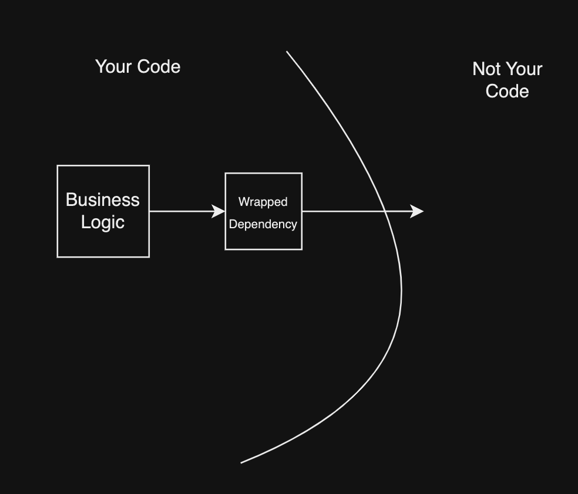
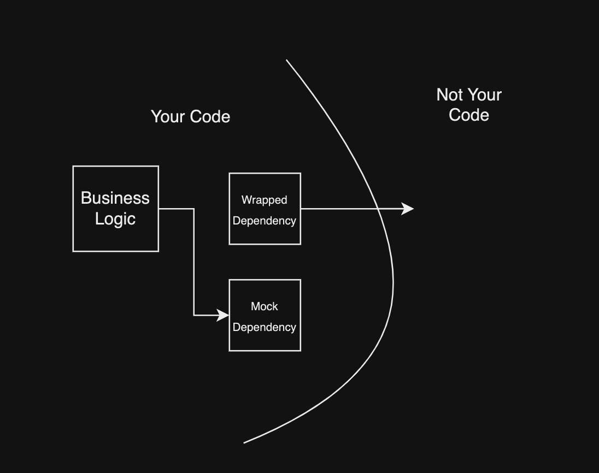
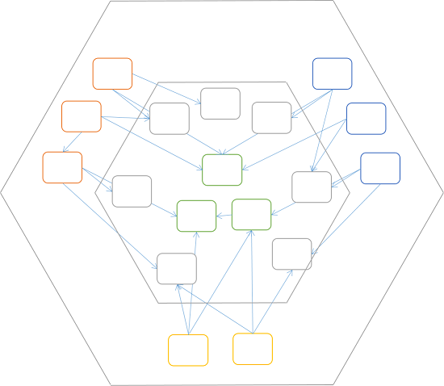

# Simple Unit Testing In The Real World With Dependencies
I’m an iOS engineer by trade, but as I’ve explored other platforms during my career, I’ve started to find areas where good ideas in software have developed in parallel across different fields. One example of this is the concept of “topics” used in ROS, or the Robotics Operating System. From [the ROS wiki](http://wiki.ros.org/Topics)

> Topics are named buses over which nodes exchange messages. Topics have anonymous publish/subscribe semantics, which decouples the production of information from its consumption. In general, nodes are not aware of who they are communicating with. Instead, nodes that are interested in data subscribe to the relevant topic; nodes that generate data publish to the relevant topic.

Folks coming from a backend or distributed systems background will feel some sense of familiarity reading this. This is nearly identical to microservices communicating via an asynchronous message broker, however because the language is different, when I was talking with my friend in robotics he was under the impression that he knew nothing about how to approach distributed system design. Someone with a backend background would likely feel the same about robotics.

Most development consists of patterns like that, which are applicable agnostic of platform, so it ought to be easy for developers to move between areas of work. A person doing iOS should be able to do embedded systems, backend or robotics.

Today we’re going to look at another universal pattern, dependency injection. As I’ve practiced dependency injection at work, I genuinely feel like it’s changed the way I think about software architecture. I’ve previously felt testing was difficult, and folks I’ve talked to have felt the same. I no longer feel that way. This style of dependency injection is well established elsewhere[1], but in the circles I run in, it seems relatively unknown.

I’ll be using [pytest](https://github.com/pytest-dev/pytest) and Point Free’s [Swift Dependencies](https://github.com/pointfreeco/swift-dependencies) library throughout.

## What is a dependency?
This one weird trick will make all [2] of your code testable!

The term “dependency” is hopelessly overloaded, but it’s the term of art used for what I’m talking about here, so I’m going to keep using it. A quick overview of things that are called dependencies.
1. Libraries and frameworks your program relies on, usually developed by someone else, sometimes downloaded over the internet and integrated into your project. Sometimes also referred to as “packages”.
2. [Compiler dependencies.](https://www.geeksforgeeks.org/dependency-graph-in-compiler-design/#)
3. Any unit of work a function delegates to some other system or object. [3]

When I talk about dependencies in this article, I’m not talking about 1 or 2, and we only care about a small subset of 3. 3 is overly inclusive for our goal, which is to do only what we need to get work done and get tests passing, so we’ll only focus on the subset of 3 that’s making our lives especially difficult.

The dependencies we care about are the things that are difficult to test. These dependencies usually reach outside of your program or run code that doesn’t belong to you. Here’s a non-exhaustive list of typical difficult dependencies:
- A web server
- Time/clocks
- Random number generators
- UI
- Loggers
- A robotic arm
- An autonomous vehicle
- A database
- A nuclear reactor

Each of these could be utilized in a CI/CD pipeline, but they’re likely to make your tests slow, nondeterministic, overly complicated and expensive to run, some much more so than others.

We can split dependencies into two general categories.
1. Input dependencies. These provide an additional piece of input to our function, but they aren’t passed in with the rest of the parameters. Examples include a GET request to a web server, a UUID generator, or the current time.
2. Output dependencies. Also commonly referred to as “[side effects](https://en.wikipedia.org/wiki/Side_effect_(computer_science))”, output dependencies cause a change somewhere else. In addition to the return value, these actions are the output of your function. Examples include engaging the throttle on a car, writing a row to a database, altering mutable object state, or rendering UI.

When we’re writing tests, the typical flow is to provide input to a system or function, and assert against the expected output. Dependencies break this by introducing uncontrollable input and output. How do we fix this? Dependency isolation.

## What is dependency isolation?
There are several ways to do it, and the best one will depend on the language you’re using and the tools available. The basic idea is to make a very thin wrapper around some sort of action you’d like to take that requires a dependency. When I say thin, I mean as little logic as possible. We will not be unit testing our wrapped dependencies [2], so they have to be simple enough that you can be sure they work either just by looking at them, or after a few semi-manual integration tests (more on that later). It should only contain enough code to perform the desired action, and return a value if relevant. We will not be testing the code in our dependency wrappers, so we are biting the bullet of sub 100% test coverage in favor of making testing as easy as possible so that good, relevant, useful tests get written to cover as much of our codebase as possible.

Through the lens of this pattern, your entire codebase can be modeled like this.



You have modularized business logic you’d like to test that makes calls to wrapped dependencies which interact with the dependencies themselves, be it a web server or a clock.

Then, when we wish to place that code under test, we do the following transformation. [4]



We sub in a mock dependency that does not interact with anything outside our program, and may return mock data if relevant. When our code is under test, we do not actually care if the database in the web server we send a request to has a new row. That’s not our code, so we aren’t going to test it. In that case, we only care how our business logic reacts to errors or successful responses. Knowing that the function that would normally make the request has been called is good enough.

## Wait, what do I do with the rest of my code?
The beauty is it doesn’t matter. Use whatever architecture you like for the rest. This pattern is universally applicable.

If you want to understand where dependency injection fits into existing architectures, nearly all the popular ones include some sort of boundary between business logic and dependencies, even if it’s not described in those exact words. The [Ports And Adapters](https://blog.ploeh.dk/2013/12/03/layers-onions-ports-adapters-its-all-the-same/) architecture for example.



You see something nearly identical in [The Clean Architecture](https://blog.cleancoder.com/uncle-bob/2012/08/13/the-clean-architecture.html).


Today we only care about the boundary between the outermost blue circle and the second outermost green circle. That’s where our dependency wrappers live.

## How do I isolate my dependencies?
The TL;DR:
1. Identify an action.
2. Wrap it in a function. That function can have parameters, return, throw, or be asynchronous if your language supports it. It’s a normal function.
3. Inject that function wherever it’s needed.
Starting with Python, let’s look at an example

```python
import requests
import json

def reverse_cat_fact():
  fact_response = requests.get("https://catfact.ninja/fact")
  fact = json.loads(fact_response.text)["fact"]
  return fact[::-1]

print(reverse_cat_fact())
```

This is a very simple version of a function that would normally be somewhat difficult to test. It makes a request to a live server, parses a response and returns a portion of the response in reverse.

`reverse_cat_fact` is difficult to test because there’s no way to call it without causing a request to a live web server. That request is liable to fail occasionally and to be slow even if it does succeed which breaks our rules of good testing. The success or failure of the test relies on several things outside of our codebase.
- Is the internet connection to our testing machine functioning
- Every system between our machine and the cat facts web server (routers, ISP, DNS, etc)
- The cat facts server itself including its routing, database, etc

It’s important that we don’t interact with any of those things, so let’s start refactoring. This function can be separated into business logic, and dependency interaction. 
Business logic:
1. Reverse a string.

Dependency interaction:
1. Send a GET request to a web server.
2. Parse out the “fact” field from the JSON response. [5]
3. If that can’t be done for whatever reason, throw an error.

Let’s refactor the function to reflect that separation

```python
import requests
import json

def get_cat_fact():
  fact_response = requests.get("https://catfact.ninja/fact")
  return json.loads(fact_response.text)["fact"]

def reverse_cat_fact():
  fact = get_cat_fact()
  return fact[::-1]

print(reverse_cat_fact())
```

This is better, but still not testable. `reverse_cat_fact` still makes a request to a live server. One option to fix this is to inject `get_cat_fact`, our new dependency wrapper, as a parameter.

```python
import requests
import json

def get_cat_fact():
  fact_response = requests.get("https://catfact.ninja/fact")
  return json.loads(fact_response.text)["fact"]

def reverse_cat_fact(cat_fact_client = get_cat_fact):
  fact = cat_fact_client()
  return fact[::-1]

print(reverse_cat_fact())
```

Here, we add a parameter to `reverse_cat_fact`, and make it default to the `get_cat_fact` function. Setting `get_cat_fact` as a default parameter means our `reverse_cat_fact` calls won’t get too verbose as we use the function throughout our program. When we want to test `reverse_cat_fact`, all we need to do is pass in a new function in place of `get_cat_fact`.

```python
def test_reverse_cat_fact():
    assert reverse_cat_fact(cat_fact_client=lambda: "Hello") == "olleH" # Passes!
```

The lessons from this simple example can be applied to any kind of dependency, not just networking calls. This also works with clocks, robotic arms, random number generators, and all of the other dependencies we listed earlier. Parameter injection [is also used in Swift](https://cocoacasts.com/dependency-injection-in-swift), though there are some slight differences due to type safety.

There are however a few significant problems with this approach. If a function has a dependency, then all functions that use that function will also need to have that dependency in their parameter lists. Parameter lists in large code bases with many layers are liable to get very very long. That makes testing more difficult and code more difficult to read.

It also isn’t obvious which dependencies need to be overridden for a test. You either have to override every dependency or risk using live dependencies. If new dependencies are added to a function under test later, existing tests might still run just fine, even if the changes would cause live dependencies to be utilized in the tests.

The [swift-dependencies library](https://github.com/pointfreeco/swift-dependencies) offers us some solutions to those problems in the form of an “[Inversion of Control Container](https://martinfowler.com/articles/injection.html)”. We start by registering our dependency wrapper to a global store.

```swift
private enum GetCatFactKey: DependencyKey {
  static let liveValue: () async throws -> String = {
    let (data, _) = try await URLSession.shared.data(from: URL(string: "https://catfact.ninja/fact")!)
    let factResponse = try JSONDecoder().decode(FactResponse.self, from: data)
    
    return factResponse.fact
  }
  
  static var testValue: () async throws -> String = unimplemented("GetCatFact")
}
```

We register two wrappers. The second will automatically be used in test runs and the first will be used all other times. The `unimplemented` function will automatically fail in test runs to let you know that your test is exercising a dependency you possibly didn’t think would be exercised. If you did intend for that dependency to be exercised, you can override it for that test.

```swift
func reverseCatFact() async throws -> String {
  @Dependency(\.getCatFact) var getCatFact
  let fact = try await getCatFact()
  return String(fact.reversed())
}
```

Here we have the Swift translation of our `reverse_cat_fact` Python function. We fetch whichever dependency wrapper is in use instead of passing it in as a parameter, and then from there it’s exactly the same.

```swift
func testReverseCatFact() async throws {
  try await withDependencies { dependencies in
    dependencies.getCatFact = { "Hello" }
  } operation: {
    let reversed = try await reverseCatFact()
    XCTAssertEqual(reversed, "olleH") // Passes!
  }
}
```

And finally the test. Some context: `withDependencies` is a function that allows you to configure dependencies before running an `operation`. Here we replace the default `testValue` for `getCatFacts` with a function that simply returns “Hello” just like before. Then we assert on the result of `reverseCatFact`.

Let’s go over each of the problems we noted from the other approach and see how they get solved.
- Parameter lists in large code bases with many layers are liable to get very very long.
    - No longer an issue because dependencies aren’t passed in as parameters. Instead they’re fetched from a global store at runtime.
- It isn’t obvious which dependencies need to be overridden for a test. You either have to override every dependency or risk using live dependencies. If new dependencies are added to a function under test later, existing tests will still run just fine, even if the changes would cause live dependencies to be utilized in the tests.
    - The `unimplemented` function we use for the `testValue` ensures that a live dependency is never called, and provides us with helpful information so we know where a dependency was used. This might tell us that a dependency we didn’t expect to be called in our test, was in fact called.

Lastly here’s an example where dependencies are not overridden

```swift
func testReverseCatFact() async throws {
    let reversed = try await reverseCatFact()
    XCTAssertEqual(reversed, "olleH") // Fails! getCatFact is unimplemented
}
```

This is a test of input dependencies, but what about output dependencies? How do we know if our `turnOnNuclearReactor` function gets called? In Python this is easy with MagicMocks. You can simply assert against the number of times a function was called. With a little more tooling, you could do the same in Swift.[6]

```swift
func testNumCalls() async throws {
    let (spy, fn) = spy({ })
    try await withDependencies { dependencies in
      dependencies.turnOnNuclearReactor = fn
    } operation: {
      try await reactorStartupSequence()
      
      XCTAssertEqual(spy.callCount, 1)
    }
}
```

## Semi-automatic Integration Testing
Sometimes you do actually want to make sure your code works with live dependencies though. The traditional way you might do that would be to boot up your app, and manually navigate to the screen that will cause your dependency to be exercised. If your screen doesn’t render, you know the code that interacts with your dependency might not be working. You set some breakpoints and run it again.

Dependency isolation, however, actually makes it much easier to ensure your dependency interaction code works. You can write tests that only exercise your live dependency wrapper, without involving the rest of your code. A great example of this are those cases where you’re going to hit a backend which will respond with some JSON, and you want to make sure your code parses realistic payloads correctly. This is very easy to do now that your dependency is isolated in a wrapper. Here’s one way you could do that with swift-dependencies.

```swift
func testReverseCatFact() async throws {
  let fact = try await DependencyValues.live.getCatFact()
  XCTAssertGreater(fact.count, 0)
}
```
Since this sort of test uses a live dependency, it should not be included when you run your unit tests, on CI or elsewhere for all the same reasons you shouldn’t use live dependencies in your unit tests. In practice I’ve mostly run these manually and one at a time, but you could create suites of these tests to assist in debugging or collecting diagnostics. Imagine having a suite of these tests you could run every time you set up a new robot. It might make it much easier to find a disconnected component!

Everything that swift-dependencies does is also possible in Python (the shape and the spelling would change), but the pattern doesn’t seem to be very popular, likely because MagicMocks are so easy to use. In combination with `patch`, no changes need to be made to code at all to make it testable. However there are arguments to be made that digging into function implementation like that is bad practice, and that you should only test input and output. More on that in a future blog post. [7]

Here’s a catalog of libraries for dependency injection in Python: https://github.com/sfermigier/awesome-dependency-injection-in-python

## Why was this guide bilingual?
Every time I’ve worked on a new platform, I’ve learned something new and brought it wherever I went after. I did some Ruby on Rails work at my first job, and decided I liked its CRUD routing, so [I implemented it in Vapor](https://github.com/twof/VaporCRUDRouter). Vapor was the first time I used reactive streams, and I used them later in my iOS work. When I did backend and robotics work in Python for my last job, I brought learnings from the Swift testing practices we’ve discussed here. Using Python’s MagicMocks inspired [the FunctionSpy library](https://github.com/twof/FunctionSpy) I wrote for this article. Swift Dependencies itself was likely inspired by the authors’ background in web development and math. People who move between fields bring good ideas with them wherever they go, and we’re better off for it. So why is moving between platforms difficult?

For the past few months I’ve been hunting for a job in climate change, and there aren’t many serious companies in that domain hiring iOS engineers. There simply isn’t much you can do to tackle the problem from your phone.[8] The most important work is building physical infrastructure and doing bleeding edge R&D; Things like carbon sequestration, solar and wind farms, fusion research, recycling, low-carbon cement, efficient agricultural tech, and automation for all of the above. The places doing that work are hiring firmware, backend, data, robotics, and embedded systems engineers. Frontend[9] largely isn’t necessary.

That means if we’re going to actually hit climate goals, a significant number of folks currently working as frontend engineers are going to need to be able to switch to something else. I’m okay with learning new things! I’ll be learning new things regardless, but it’s a question of whether I’ll be learning to work around bugs in Apple’s UI frameworks to increase retention metrics by a fraction of a point, or if I’m learning a new platform to save the planet. I’d much rather be doing the latter.

## Notes
[1] The Java world has a very popular version of the dependency container pattern in the form of “Spring Beans”, but their terminology and approach is different. People like Dagger on Android. Both are much more OO.

[2] Excluding dependency wrappers themselves. They can’t, and shouldn’t be unit tested.

[3] If you want to see the non-testing impacts of dependency injection, I’d suggest [this excellent video](https://www.youtube.com/watch?v=J1f5b4vcxCQ) by Code Aesthetics.

[4] If you squint a bit, you might notice that this is also more or less an application of [the Strategy Pattern](https://en.wikipedia.org/wiki/Strategy_pattern).

[5] There’s an argument to be made that JSON parsing is also business logic, however doing this work in our dependency wrapper makes testing much easier because now we can just return a plain string from our mock. I tend to err on the side of being overly inclusive in my dependency wrappers when it makes testing easier, and then refactoring to make them thinner when I think there’s something in them that ought to be unit tested.

[6] I created [a library](https://github.com/twof/FunctionSpy) to do this.

[7] The TL;DR is that you really ought to also return your side effects. [The Composable Architecture](https://github.com/pointfreeco/swift-composable-architecture) (think spicy [Redux](https://en.wikipedia.org/wiki/Redux_(JavaScript_library)) (think a [reducer](https://en.wikipedia.org/wiki/Fold_(higher-order_function)) + a store)) uses this pattern. Haskel requires this pattern in the form of the IO monad.

[8] I’m open to being convinced otherwise on this, but I haven’t seen it yet. Some of [the companies](https://www.heirloomcarbon.com/) I’m looking at are talking about sequestering upwards of 90 million tons of carbon a year, so that’s where the bar is.

[9] When I say frontend here, I mean both web and mobile, regardless of UI framework.

## End Notes
Doing research for this I ran into a bunch of other folks who have done similar work on dependency injection and its place in architecture. Here are a few of my favorites:
- [Boundaries](https://www.destroyallsoftware.com/talks/boundaries) by Gary Bernhardt at Destroy All Software
- [From Dependency Injection To Dependency Rejection](https://blog.ploeh.dk/2017/01/27/from-dependency-injection-to-dependency-rejection/) by Mark Seemann
- [Functional Architecture Is Ports And Adapters](https://blog.ploeh.dk/2016/03/18/functional-architecture-is-ports-and-adapters/) by Mark Seemann

Views get special status in the iOS world in architectures that try to be all encompassing ([MVVM, MVP, MVC, VIPER, etc](https://www.techaheadcorp.com/blog/mvc-vs-mvvm-vs-mvp-vs-viper/)), and get odd treatment when it comes to testing. In my opinion, views are just another dependency, and architectural decisions should follow from that. It’s easier to make this argument now that iOS has [native declarative UI](https://en.wikipedia.org/wiki/SwiftUI).

